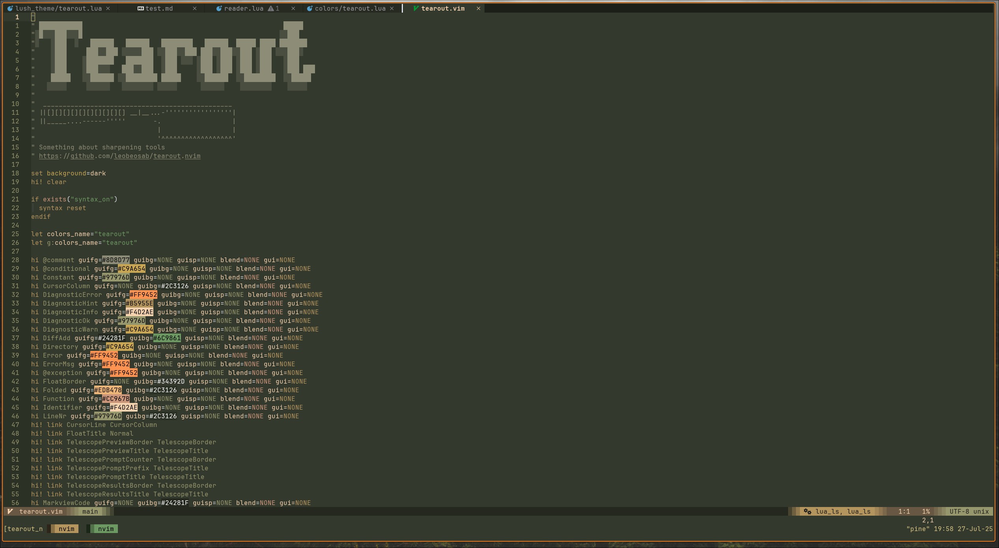
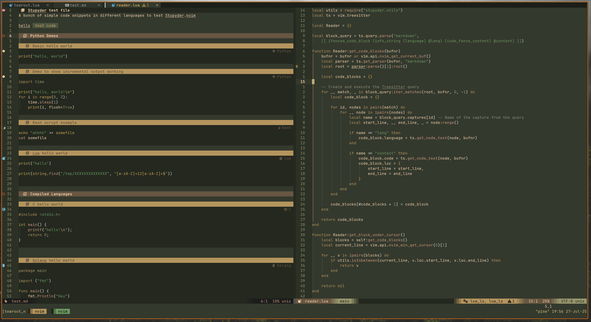

# Tearout.nvim
A wood working and nature inspired colorscheme for Neovim + Ghostty 




## Installation
You can install using your favorite neovim package manager. 
```
"leobeosab/tearout.nvim"
```

### Lazy Example
```lua
return {
  "leobeosab/tearout.nvim",
  lazy = false,
  priority = 1000,
  config = function()
    vim.cmd("colorscheme tearout")
  end,
}
```

### Dev Installation
If you want to tweak the theme yourself you'll need [Lush](https://github.com/rktjmp/lush.nvim) for modifying the theme and seeing changes in real time. Then shipwright to build the .lua / .vim colorscheme files.
```lua
return {
  "leobeosab/tearout.nvim",
  dependencies = {
    "rktjmp/lush.nvim",
    "rktjmp/shipwright.nvim",
  },
  lazy = false,
  priority = 1000,
  config = function()
    vim.cmd("colorscheme tearout")
  end,
}
```

## Thanks
Special thanks to [@xero](https://github.com/xero) who created the [miasma](https://github.com/xero/miasma.nvim) theme. It inspired me to make my own colorschemes. And of course the creators of [Lush](https://github.com/rktjmp/lush.nvim)


## License 
MIT License, do whatever you please with it!
